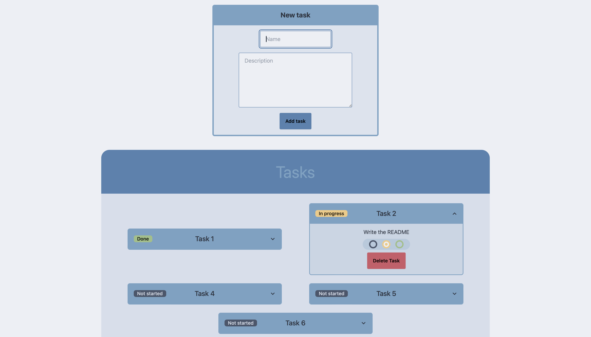

To-Do List in React
=====================

This is a simple to-do list application built using React and TypeScript. It allows you to add, delete, and track the progress of tasks. The tasks are saved in the browser's local storage, so they persist even if you close the browser.

Installation
------------

To install and run the application, you need to have Node.js and npm installed on your machine.

1. Clone the repository:
```
git clone https://github.com/KadirKess/React-ToDo-List.git
```
2. Navigate to the project directory:
```bash
cd React-ToDo-List
```
3. Install the dependencies:
```
npm install
```
4. Start the development server:
```
npm start
```
The application should now be running at `http://localhost:5173`.

Usage
-----

When first launching the app, you will have no tasks, you can create one by clicking on the New Task button.
After that, the created task will appear below, you will be able to change the state of the task, as well as deleting it.

Screnshot
-----


To Do
-----
Add the ability to edit tasks.
